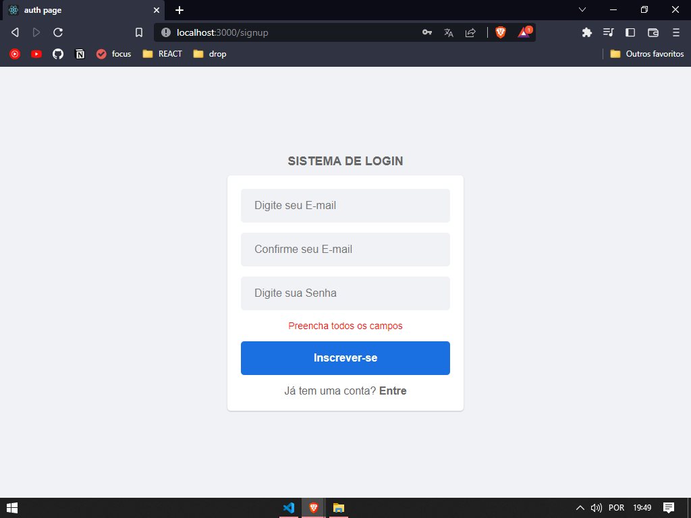
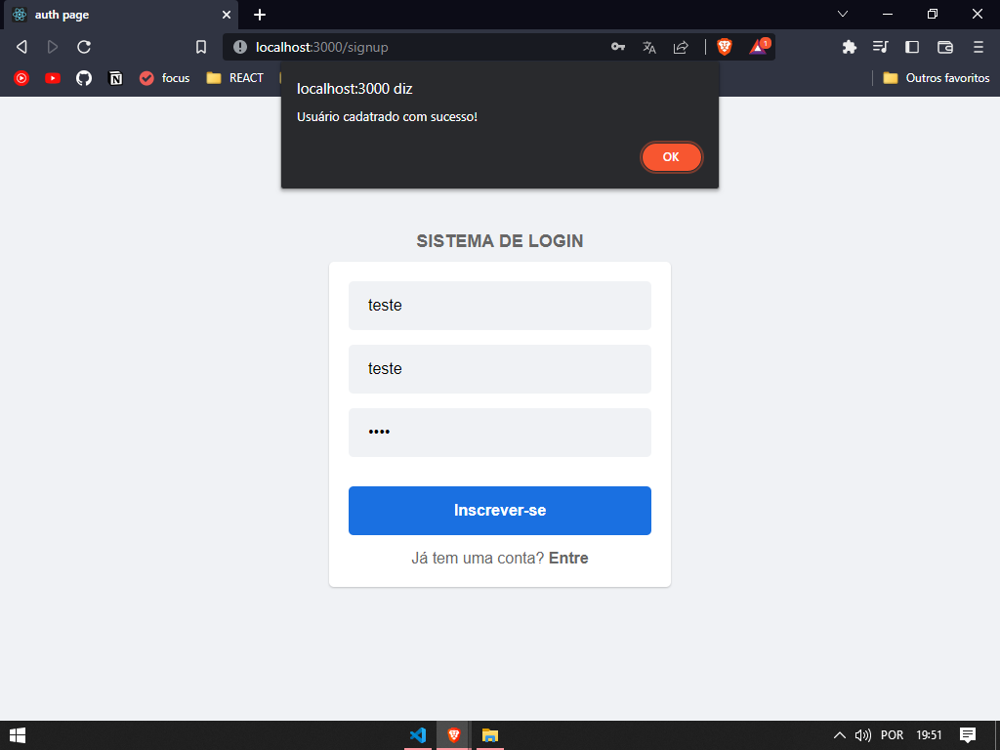

# 🕗 Autenticação com localStorage
Um simples sistema de autenticação utilizando localStorage📁 
validação funcional.

## ✒️ Autores

* **Nailson** - [desenvolvedor](https://github.com/nailsonlima)

## 🎁 Expressões de gratidão

* Obrigado pelo seu tempo e apoio!
* Espero ter sido útil!❤

---
Feito com ❤️ por [Naison Lima](https://gist.github.com/nailsonlima) 😊
